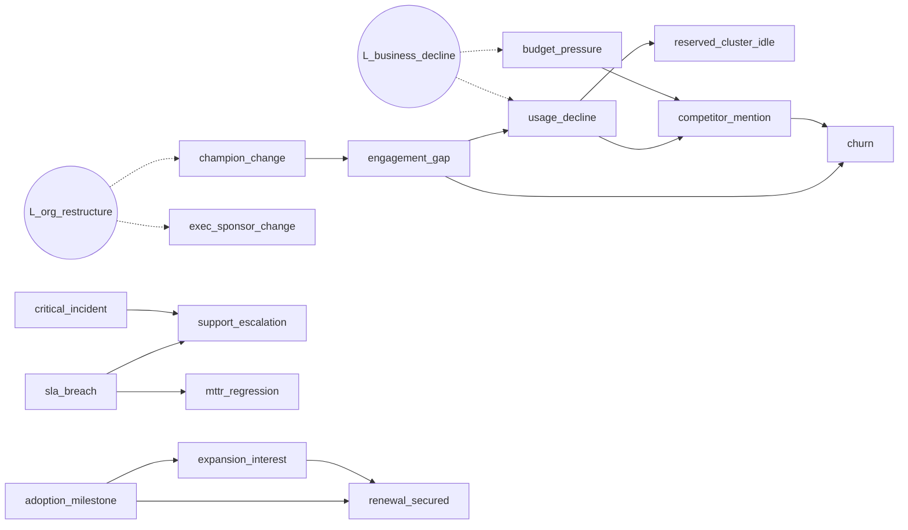
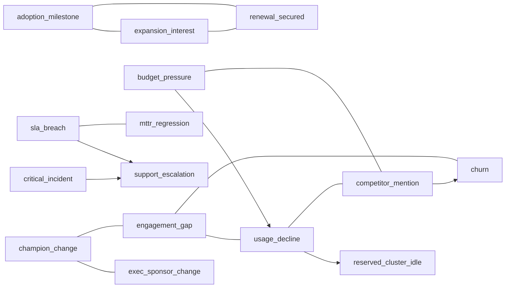
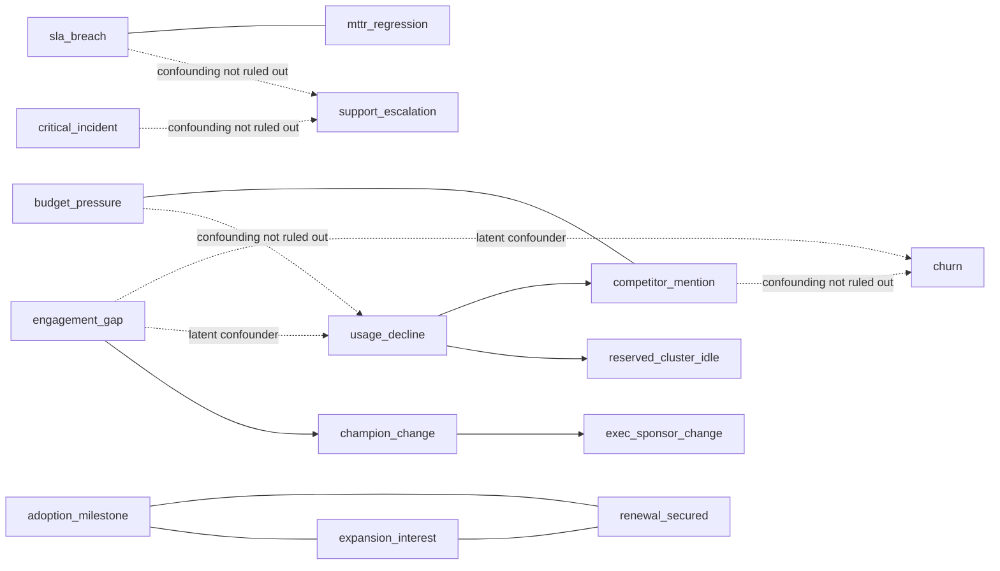

# Learned causal schema vs. hand-authored templates

## Ground truth (latents shown dashed)



## TEMPLATE — what ships today

```mermaid
graph LR
  champion_change[champion_change] -->|0.8| exec_sponsor_change[exec_sponsor_change]  %% WRONG
  champion_change[champion_change] -->|0.85| engagement_gap[engagement_gap]
  engagement_gap[engagement_gap] -->|0.8| usage_decline[usage_decline]
  usage_decline[usage_decline] -->|0.75| churn[churn]  %% WRONG
  budget_pressure[budget_pressure] -->|0.7| usage_decline[usage_decline]  %% WRONG
  support_escalation[support_escalation] -->|0.65| critical_incident[critical_incident]  %% WRONG
  competitor_mention[competitor_mention] -->|0.85| churn[churn]
  adoption_milestone[adoption_milestone] -->|0.72| renewal_secured[renewal_secured]
  sla_breach[sla_breach] -->|0.6| churn[churn]  %% WRONG
```

Every edge directed, every edge with a typed confidence, no abstentions.

## PC-stable — CPDAG



Solid arrows = oriented. Plain lines = **related, direction not identifiable**.

## FCI — PAG



Dotted = FCI cannot rule out an unmeasured common cause. That verdict has no representation in the template system at all.
